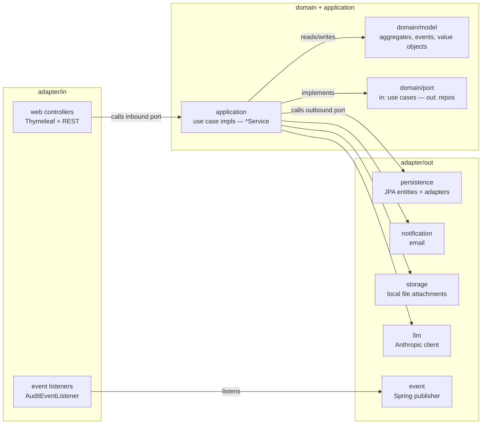

# Architecture

Majordomo is a single Spring Boot application organized as a set of services
named after household staff. Each service follows hexagonal architecture
(ports + adapters, ADR-0004) so the domain core never depends on Spring,
JPA, or any specific transport.

## Top-down view

Hard rules (enforced by ArchUnit in `HexagonalArchitectureTest`):

- `domain.model` has zero Spring or JPA imports (Jakarta Validation is the only
  acknowledged exception, see CLAUDE.md "Known Trade-offs").
- `domain.port` does not depend on adapters.
- `application` does not depend on adapters.
- `adapter.out` does not depend on `adapter.in`.
- `adapter.in` does not depend on `adapter.out` (added by #248).
- Production code calls `UuidFactory.newId()`, never `UUID.randomUUID()`
  (added by #249).

Cycles between top-level slices are detected and fail the build.

## Services

| Service | Domain package | Notable use cases |
|---|---|---|
| Steward | `domain/model/steward` | `ManagePropertyUseCase`, `PropertyContact` association |
| Concierge | `domain/model/concierge` | `ManageContactUseCase`, vCard generation |
| Herald | `domain/model/herald` | `ManageScheduleUseCase`, service-record history, due-date computation |
| Ledger | `domain/model/ledger` | `QuerySpendUseCase` — read-only derivations |
| Envoy | `domain/model/envoy` | `IngestJobPostingUseCase`, `ScoreJobPostingUseCase`, rubric versioning |
| Identity | `domain/model/identity` | User, Membership, Credential, ApiKey, OAuthLink |
| Dashboard | `domain/model/DashboardSummary` | aggregation over the others |

Each service exposes a sibling REST controller under `/api/...` and a
Thymeleaf web page controller under the unprefixed path:

| URL prefix | Web controller | REST controller |
|---|---|---|
| `/properties` | `steward.PropertyPageController` | `steward.PropertyController` (`/api/properties`) |
| `/contacts` | `concierge.ContactPageController` | `concierge.ContactController` (`/api/contacts`) |
| `/schedules` | `herald.SchedulePageController` | `herald.ScheduleController` (`/api/schedules`) |
| `/ledger` | `ledger.LedgerPageController` | `ledger.LedgerController` (`/api/ledger`) |
| `/envoy` | `envoy.EnvoyPageController` | `envoy.EnvoyController` (`/api/envoy`) |
| `/audit` | `audit.AuditPageController` | (no REST surface) |
| `/account/api-keys` | `identity.AccountApiKeyPageController` | `identity.ApiKeyController` (`/api/organizations/{orgId}/api-keys`) |
| `/dashboard` | `DashboardPageController` | `DashboardController` (`/api/dashboard`) |

This split keeps each REST surface pure and the page controllers free to
evolve UX-driven shapes (filters, picker dropdowns, indexed form binding).

## Request flow: `GET /properties/{id}`

1. **Spring Security filter chain** — `ApiKeyAuthenticationFilter`,
   `CorrelationIdFilter`, then form-login / OAuth2 authentication.
2. **`PropertyPageController.detail(id, principal, model)`** —
   - Resolves the user's organization via `CurrentOrganizationResolver`
   - Verifies cross-org access via `OrganizationAccessService.verifyAccess(...)`
   - Loads the property, parent, children, linked contacts, schedules,
     recent service records, attachments — all through inbound ports
   - Builds candidate-contact list for the link picker
   - Returns the `property-detail` Thymeleaf template name
3. **Thymeleaf** renders the template with the populated model.
4. **`GlobalExceptionHandler`** maps any `EntityNotFoundException` to 404 and
   `AccessDeniedException` to 403; everything else to 500 with a JSON
   `{ message, correlationId }` body.

## Adding a new feature

The shape of a typical feature is:

1. **Domain first**: add records / entity fields / events under
   `domain/model`. Use Jakarta Validation annotations for invariants the
   adapters need to honor.
2. **Port**: add a method to an existing inbound use-case interface (`domain/port/in/...`)
   or outbound repo (`domain/port/out/...`), or — rarely — define a new port
   interface.
3. **Application**: implement the inbound port in `application/...`. Stay
   free of Spring annotations except `@Service`. Avoid pulling in adapter
   classes.
4. **Adapters**: update JPA entities + mappers + adapter classes for the
   outbound side; update web controllers for the inbound side. Keep
   controllers under the 500-line checkstyle cap — split a sibling
   controller for orthogonal POST routes (see `PropertyContactLinkController`).
5. **Tests**: prefer `@WebMvcTest` slice tests over `@SpringBootTest`
   (ADR-0021). Mock the inbound ports — do **not** mock the application
   service unless you're slicing the controller alone.
6. **Migration**: any new column or table goes through a Flyway migration
   `V<next>__description.sql`; never edit a previously-shipped migration.
7. **Verify**: run `./mvnw verify -DskipITs` and `gh pr checks <PR#>` after
   pushing — CI gates merges via CodeQL too.

See [development.md](development.md) for the full pre-PR checklist.
