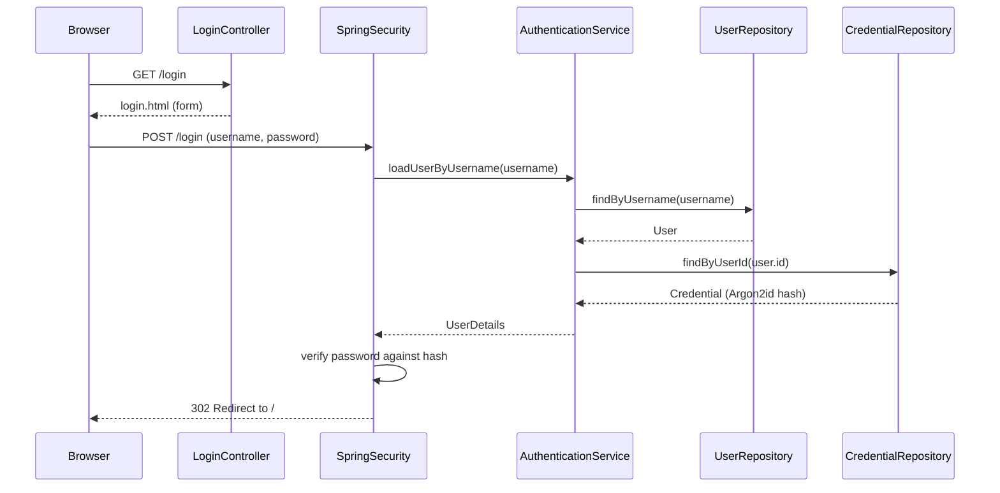
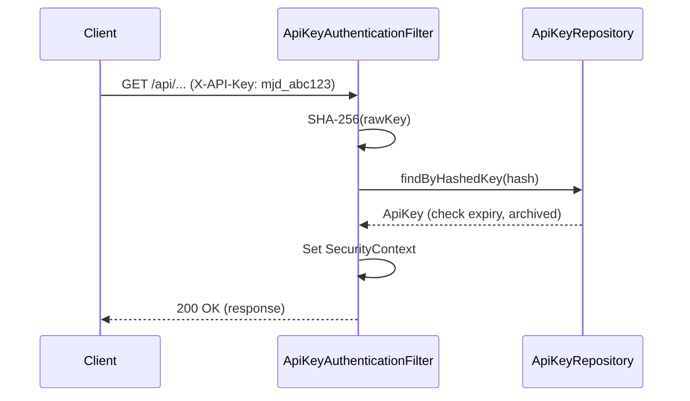

# Authentication

## Overview

Majordomo uses Spring Security for authentication with three methods:

1. **Form-based login** — username/password at `/login`
2. **OAuth2 Google** — login via Google account
3. **API keys** — machine-to-machine authentication via `X-API-Key` header

All requests include a correlation ID (`X-Correlation-ID` header) for tracing through logs.

## Architecture

Authentication follows the hexagonal architecture:

- **Inbound adapter**: `LoginController` serves the login page; Spring Security handles POST /login
- **Application service**: `AuthenticationService` implements Spring Security's `UserDetailsService`
- **Outbound ports**: `UserRepository.findByUsername()` and `CredentialRepository.findByUserId()`
- **API key filter**: `ApiKeyAuthenticationFilter` intercepts `X-API-Key` headers before form auth
- **Correlation filter**: `CorrelationIdFilter` assigns/propagates `X-Correlation-ID` on every request

Spring Security concerns stay in the adapter layer. The domain model knows nothing about
Spring Security.

## Password Hashing

Passwords are hashed with Argon2id via Spring Security's `Argon2PasswordEncoder`. Argon2id is
the Password Hashing Competition winner, resistant to GPU/ASIC attacks with configurable
memory cost.

## Form Login Flow

1. User visits `/login` (GET) — `LoginController` returns the Thymeleaf login form
2. User submits credentials (POST /login) — Spring Security intercepts
3. Spring Security calls `AuthenticationService.loadUserByUsername()`
4. `AuthenticationService` loads the `User` and `Credential` via domain ports
5. Spring Security verifies the password against the Argon2id hash
6. On success, redirects to `/`; on failure, redirects to `/login?error`

## OAuth2 Google Login Flow

1. User clicks "Sign in with Google" on the login page
2. Spring Security OAuth2 Client redirects to Google's authorization endpoint
3. User authenticates with Google and grants consent
4. Google redirects back with an authorization code
5. Spring Security exchanges the code for tokens and retrieves user info
6. The system looks up or creates an `OAuthLink` mapping the Google identity (`provider=google`, `externalId`, `email`) to a Majordomo `User`
7. If no matching user exists, one is created automatically
8. The user is authenticated and redirected to `/`

The `OAuthLink` entity supports multiple OAuth providers per user. A user can have both a
password credential and one or more OAuth links.

## API Key Authentication

API keys provide stateless, machine-to-machine authentication for programmatic access.

1. Create a key via `POST /api/organizations/{orgId}/api-keys` (requires session auth)
2. The plaintext key (prefixed `mjd_`) is returned exactly once — store it securely
3. Include the key in subsequent requests as `X-API-Key: mjd_...`
4. `ApiKeyAuthenticationFilter` SHA-256 hashes the provided key and looks it up in the database
5. If valid and not expired/revoked, the request is authenticated

Keys can be listed (`GET`) and revoked (`DELETE`) via the same endpoint. Revocation is a soft
delete (sets `archived_at`). See [api-keys.md](api-keys.md) for full details.

## Adding Users

Currently users are seeded via Flyway migrations. The default user:

- Username: `robsartin`
- Email: `rob.sartin@gmail.com`

To add a new user, create a Flyway migration that inserts into `users`, `credentials`,
`organizations`, and `memberships` tables. Use `Argon2PasswordEncoder` to generate the
password hash.

## Sequence Diagrams

### Form Login

### API Key

