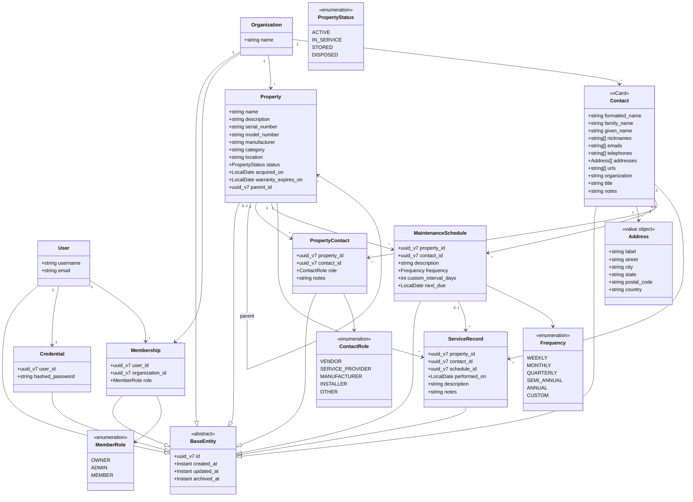

# Domain Model

```mermaid
classDiagram
    direction TB

    %% ── Base ──
    class BaseEntity {
        <<abstract>>
        +uuid_v7 id
        +Instant created_at
        +Instant updated_at
        +Instant archived_at
    }

    %% ── Identity ──
    class User {
        +string username
        +string email
    }

    class Credential {
        +uuid_v7 user_id
        +string hashed_password
    }

    class Organization {
        +string name
    }

    class Membership {
        +uuid_v7 user_id
        +uuid_v7 organization_id
        +MemberRole role
    }

    class MemberRole {
        <<enumeration>>
        OWNER
        ADMIN
        MEMBER
    }

    User --|> BaseEntity
    Credential --|> BaseEntity
    Organization --|> BaseEntity
    Membership --|> BaseEntity
    User "1" --> "1" Credential
    User "1" --> "*" Membership
    Organization "1" --> "*" Membership
    Membership --> MemberRole

    %% ── The Concierge (Contacts) ──
    class Contact {
        <<vCard>>
        +string formatted_name
        +string family_name
        +string given_name
        +string[] nicknames
        +string[] emails
        +string[] telephones
        +Address[] addresses
        +string[] urls
        +string organization
        +string title
        +string notes
    }

    class Address {
        <<value object>>
        +string label
        +string street
        +string city
        +string state
        +string postal_code
        +string country
    }

    class ContactRole {
        <<enumeration>>
        VENDOR
        SERVICE_PROVIDER
        MANUFACTURER
        INSTALLER
        OTHER
    }

    Contact --|> BaseEntity
    Contact "1" --> "*" Address

    %% ── The Steward (Property) ──
    class Property {
        +string name
        +string description
        +string serial_number
        +string model_number
        +string manufacturer
        +string category
        +string location
        +PropertyStatus status
        +LocalDate acquired_on
        +LocalDate warranty_expires_on
        +uuid_v7 parent_id
    }

    class PropertyStatus {
        <<enumeration>>
        ACTIVE
        IN_SERVICE
        STORED
        DISPOSED
    }

    Property --|> BaseEntity
    Property "0..1" --> "*" Property : parent

    %% ── Property-Contact Relationships ──
    class PropertyContact {
        +uuid_v7 property_id
        +uuid_v7 contact_id
        +ContactRole role
        +string notes
    }

    PropertyContact --|> BaseEntity
    Property "1" --> "*" PropertyContact
    Contact "1" --> "*" PropertyContact
    PropertyContact --> ContactRole

    %% ── The Herald (Scheduling) ──
    class MaintenanceSchedule {
        +uuid_v7 property_id
        +uuid_v7 contact_id
        +string description
        +Frequency frequency
        +int custom_interval_days
        +LocalDate next_due
    }

    class ServiceRecord {
        +uuid_v7 property_id
        +uuid_v7 contact_id
        +uuid_v7 schedule_id
        +LocalDate performed_on
        +string description
        +string notes
    }

    class Frequency {
        <<enumeration>>
        WEEKLY
        MONTHLY
        QUARTERLY
        SEMI_ANNUAL
        ANNUAL
        CUSTOM
    }

    MaintenanceSchedule --|> BaseEntity
    ServiceRecord --|> BaseEntity
    Property "1" --> "*" MaintenanceSchedule
    Property "1" --> "*" ServiceRecord
    Contact "0..1" --> "*" MaintenanceSchedule
    Contact "0..1" --> "*" ServiceRecord
    MaintenanceSchedule "0..1" --> "*" ServiceRecord
    MaintenanceSchedule --> Frequency

    %% ── Ownership ──
    Organization "1" --> "*" Property
    Organization "1" --> "*" Contact
```
