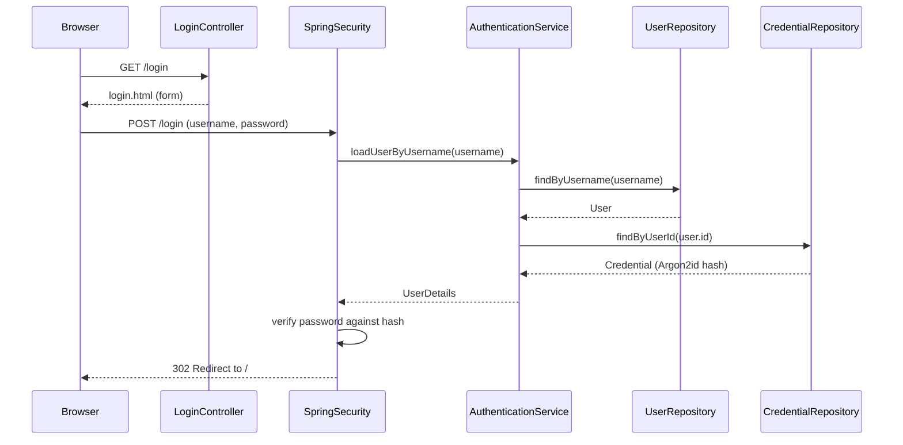
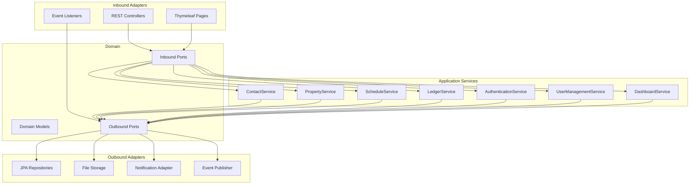
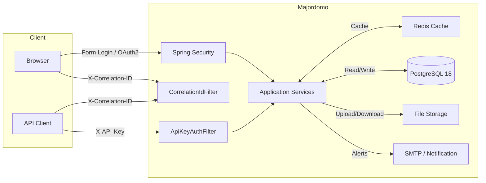

# Domain Model

```mermaid
classDiagram
    direction TB

    %% ── Base ──
    class BaseEntity {
        <<abstract>>
        +uuid_v7 id
        +Instant created_at
        +Instant updated_at
        +Instant archived_at
    }

    %% ── Identity ──
    class User {
        +string username
        +string email
    }

    class Credential {
        +uuid_v7 user_id
        +string hashed_password
    }

    class Organization {
        +string name
    }

    class Membership {
        +uuid_v7 user_id
        +uuid_v7 organization_id
        +MemberRole role
    }

    class MemberRole {
        <<enumeration>>
        OWNER
        ADMIN
        MEMBER
    }

    class OAuthLink {
        +uuid_v7 user_id
        +string provider
        +string external_id
        +string email
    }

    class ApiKey {
        +uuid_v7 organization_id
        +string name
        +string hashed_key
        +Instant expires_at
    }

    class UserPreferences {
        +uuid_v7 user_id
        +string notification_email
        +boolean notifications_enabled
        +string[] notification_categories_disabled
        +string timezone
        +string locale
    }

    User --|> BaseEntity
    Credential --|> BaseEntity
    Organization --|> BaseEntity
    Membership --|> BaseEntity
    OAuthLink --|> BaseEntity
    ApiKey --|> BaseEntity
    UserPreferences --|> BaseEntity
    User "1" --> "1" Credential
    User "1" --> "*" Membership
    User "1" --> "*" OAuthLink
    User "1" --> "0..1" UserPreferences
    Organization "1" --> "*" Membership
    Organization "1" --> "*" ApiKey
    Membership --> MemberRole

    %% ── The Concierge (Contacts) ──
    class Contact {
        <<vCard>>
        +string formatted_name
        +string family_name
        +string given_name
        +string[] nicknames
        +string[] emails
        +string[] telephones
        +Address[] addresses
        +string[] urls
        +string organization
        +string title
        +string notes
    }

    class Address {
        <<value object>>
        +string label
        +string street
        +string city
        +string state
        +string postal_code
        +string country
    }

    class ContactRole {
        <<enumeration>>
        VENDOR
        SERVICE_PROVIDER
        MANUFACTURER
        INSTALLER
        OTHER
    }

    Contact --|> BaseEntity
    Contact "1" --> "*" Address

    %% ── The Steward (Property) ──
    class Property {
        +string name
        +string description
        +string serial_number
        +string model_number
        +string manufacturer
        +string category
        +string location
        +PropertyStatus status
        +LocalDate acquired_on
        +LocalDate warranty_expires_on
        +BigDecimal purchase_price
        +uuid_v7 parent_id
        +Instant warranty_notification_sent_at
    }

    class PropertyStatus {
        <<enumeration>>
        ACTIVE
        IN_SERVICE
        STORED
        DISPOSED
    }

    Property --|> BaseEntity
    Property "0..1" --> "*" Property : parent

    %% ── Property-Contact Relationships ──
    class PropertyContact {
        +uuid_v7 property_id
        +uuid_v7 contact_id
        +ContactRole role
        +string notes
    }

    PropertyContact --|> BaseEntity
    Property "1" --> "*" PropertyContact
    Contact "1" --> "*" PropertyContact
    PropertyContact --> ContactRole

    %% ── The Herald (Scheduling) ──
    class MaintenanceSchedule {
        +uuid_v7 property_id
        +uuid_v7 contact_id
        +string description
        +Frequency frequency
        +int custom_interval_days
        +LocalDate next_due
        +BigDecimal estimated_cost
        +Instant notification_sent_at
    }

    class ServiceRecord {
        +uuid_v7 property_id
        +uuid_v7 contact_id
        +uuid_v7 schedule_id
        +LocalDate performed_on
        +string description
        +string notes
        +BigDecimal cost
    }

    class Frequency {
        <<enumeration>>
        WEEKLY
        MONTHLY
        QUARTERLY
        SEMI_ANNUAL
        ANNUAL
        CUSTOM
    }

    MaintenanceSchedule --|> BaseEntity
    ServiceRecord --|> BaseEntity
    Property "1" --> "*" MaintenanceSchedule
    Property "1" --> "*" ServiceRecord
    Contact "0..1" --> "*" MaintenanceSchedule
    Contact "0..1" --> "*" ServiceRecord
    MaintenanceSchedule "0..1" --> "*" ServiceRecord
    MaintenanceSchedule --> Frequency

    %% ── The Ledger (Finance) ──
    class SpendSummary {
        <<record>>
        +BigDecimal purchase_price
        +BigDecimal maintenance_cost
        +BigDecimal total_cost
    }

    %% ── Dashboard ──
    class DashboardSummary {
        <<record>>
        +int property_count
        +int contact_count
        +MaintenanceSchedule[] upcoming_maintenance
        +MaintenanceSchedule[] overdue_items
        +ServiceRecord[] recent_service_records
        +BigDecimal total_spend
    }

    %% ── Attachments ──
    class Attachment {
        +string entity_type
        +uuid_v7 entity_id
        +string filename
        +string content_type
        +long size_bytes
        +string storage_path
        +boolean is_primary
        +int sort_order
    }

    Attachment --|> BaseEntity

    %% ── Audit Log ──
    class AuditLogEntry {
        +uuid_v7 organization_id
        +string entity_type
        +uuid_v7 entity_id
        +string action
        +uuid_v7 user_id
        +Instant occurred_at
        +string diff_json
    }

    %% ── Notification Categories ──
    class NotificationCategory {
        <<enumeration>>
        MAINTENANCE_DUE
        WARRANTY_EXPIRING
        SITE_UPDATES
    }

    UserPreferences --> NotificationCategory

    %% ── The Envoy (Job-Posting Scoring, ADR-0022) ──
    class JobPosting {
        +uuid_v7 organization_id
        +string source_type
        +string source_url
        +string title
        +string company
        +string location
        +string raw_text
    }

    class Rubric {
        +uuid_v7 organization_id
        +string name
        +int version
        +List~Category~ categories
        +Thresholds thresholds
    }

    class ScoreReport {
        +uuid_v7 organization_id
        +uuid_v7 posting_id
        +uuid_v7 rubric_id
        +int total_score
        +Recommendation recommendation
        +List~Category~ categories
        +List~Flag~ flags
        +LlmUsage llm_usage
    }

    class Recommendation {
        <<enumeration>>
        APPLY_NOW
        CONSIDER
        SKIP
    }

    JobPosting --|> BaseEntity
    Rubric --|> BaseEntity
    ScoreReport --|> BaseEntity
    JobPosting "1" --> "*" ScoreReport
    Rubric "1" --> "*" ScoreReport
    ScoreReport --> Recommendation

    %% ── Ownership ──
    Organization "1" --> "*" Property
    Organization "1" --> "*" Contact
    Organization "1" --> "*" JobPosting
    Organization "1" --> "*" Rubric
```

## Recent additions

- **`AuditLogEntry.organization_id`** (#242, V18 migration): scopes audit
  entries to an organization so the `/audit` page filters cross-org rows
  out. Populated from domain events that already carry `organizationId`;
  events that don't (notably `ServiceRecordCreated`) record `null` until
  enriched.
- **`Property.parent_id`**: enables the parent-property picker on the add /
  edit form (#229). Cycle prevention happens in `PropertyPageController`
  by walking `findByParentId(...)` on the editing subtree.
- **`Contact.addresses`**: editable as an indexed sub-form (#239) via the
  `addresses[N].field` Spring binding pattern. Backed by
  `ContactFormCommand` + `AddressFormRow`.
- **`PropertyContact` link/unlink** (#240): the `archivedAt` field is now
  the soft-delete signal for unlinks; both the property-detail and
  contact-detail pages filter on it.
- **`Envoy` aggregates** (ADR-0022): rubric versioning is append-only;
  rescoring a posting against a new rubric version creates a new
  `ScoreReport` rather than mutating the old one.

## Authentication Sequence

## Hexagonal Architecture

## Component Diagram

